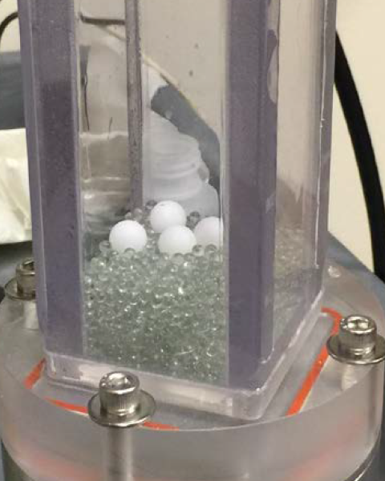

.. _sec:intro:

Introduction
============

.. raw:: html

   

   <iframe src="https://www.youtube.com/embed/RkPa0iJBU6o?autoplay=1&loop=1"
   width="320" height="240" allowfullscreen="true" frameborder="0"
   allow="accelerometer; autoplay; clipboard-write; encrypted-media; gyroscope; picture-in-picture"></iframe>
   

Beginning in the late 1990's, fluidized bed experiments were being designed
specifically to provide validation data for the recently developed CFD-DEM
model. Two of these earliest examples are due to
`Yuu, Umekage and Johno (2000) <https://doi.org/10.1016/S0032-5910(99)00277-6>`_
and  `Hoomans, et al. (2001) <https://doi.org/10.1016/S0032-5910(00)00391-0>`_.
Table 1 of LaMarche, et al. (2022) <https://TODO.edu>`_ provides a list of many
of the CFD-DEM validation experiments of the past 20+ years. One of the common
themes of these CFD-DEM validation experiments is their scale: the particle count
should not exceed a few million if they are to be modeled as discrete elements
due to the computational expense of CFD-DEM and current computational resources
available to most researchers. Most of the datasets in LaMarche et al. (2022)'s
Table 1 contain approx. 100,000 particles or fewer.

Following the single-phase CFD community, the focus of multiphase CFD is slowly
shifting from a single prediction or a best guess with a few parametric studies
to actually quantifying the influence of uncertain input parameters on the
quantity of interest. Due to the large number of CFD-DEM model inputs, an
intrusive UQ simulation campaign may require 100's or 1000's
of simulations. Therefore, the scale of the problem size which is feasible
decreases significantly. From the onset, the goal of the VSSUQ was to create a
validation dataset specifically for CFD-DEM with UQ. To accomplish this goal,
we sought a particulate experiment which satisfied the following requirements:

#. a small number of particles, less than 10,000
#. a speedy observable
#. all uncertainties characterized or bounded
#. multiphase

The experiment that was designed to meet these experiments, the VSSUQ, is the
small, rectangular bed, pictured below, containing
a few thousand common particles (glass beads) and couple (one, two, or four)
intruder particles. The lighter (HDPE) intruder particles are placed on the
bottom and, once fluidized, percolate through the bed within a few seconds the
granular segregation instability, i.e., the Brazil nut effect
`(Rosato, et al. 1987) <https://doi.org/10.1103/PhysRevLett.58.1038>`_.
The time it takes the intruders to emerge on the surface, the rise
time :math:`t_r`, is recorded as the system response quantity (SRQ) or
quantity of interest (QoI). The video above (and on the homepage) shows an
example experiment with four large intruders.
The following sections of the repo give the details of
the system geometry and operating conditions in :ref:`sec:probdescription`,
the particles in :ref:`sec:particleprops`,
and the rise time results in :ref:`sec:measurements`.

