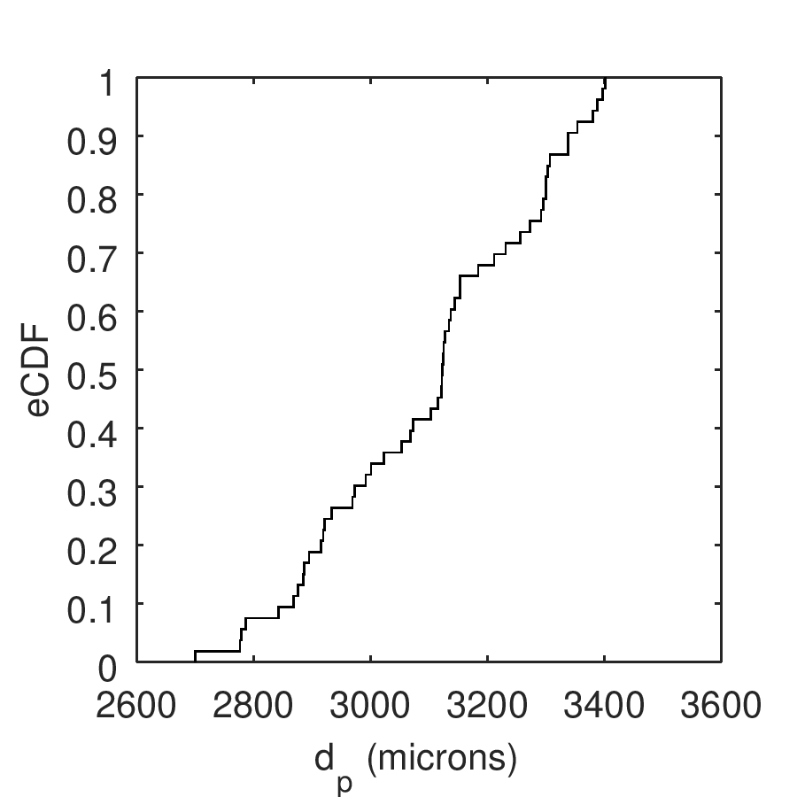
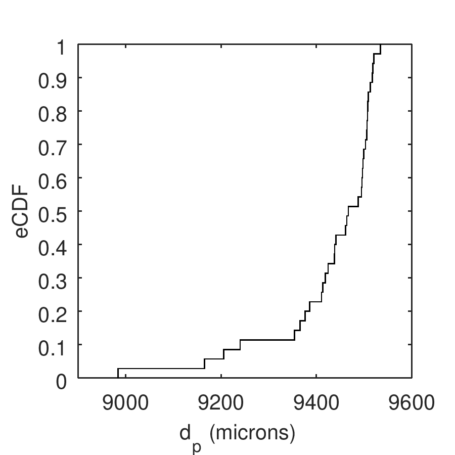
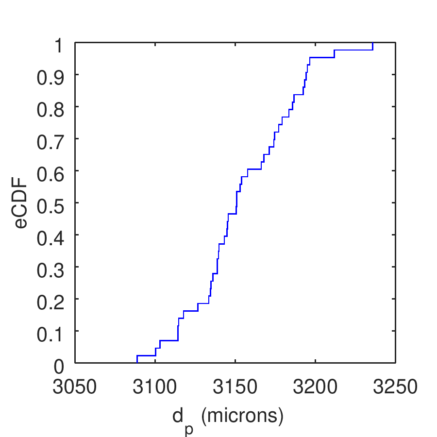

.. _sec:particleprops:

Particle Properties
===================

In this section we provide images of the empirical cumulative distribution 
function (eCDF) for the measured particle properties. Links to the raw data 
and octave scripts used to generate each image are provided with simple 
statistics for each eCDF. Properties include diameter (:math:`d_p`), 
restitution coefficient (:math:`e_{pp}`), friction coefficient 
(:math:`\mu_{pp}), and sphericity (:math:`\Psi`), for the common glass beads 
and HDPE intruders.

Particle Diameter
-----------------  

common 
^^^^^^

quick stats: 
* median  =  3122.9060
* mean    =  3101.3435
* stdev   =   187.1664
* 95 CI   =    51.5894

large intruder
^^^^^^^^^^^^^^

quick stats: 
  median  =  9467.0242
  mean    =  9430.4494
  stdev   =   118.4190
  95 CI   =    40.6783

small intruder
^^^^^^^^^^^^^^

quick stats: 
  median  =  3150.9098
  mean    =  3154.8691
  stdev   =    31.9635
  95 CI   =     9.8369

