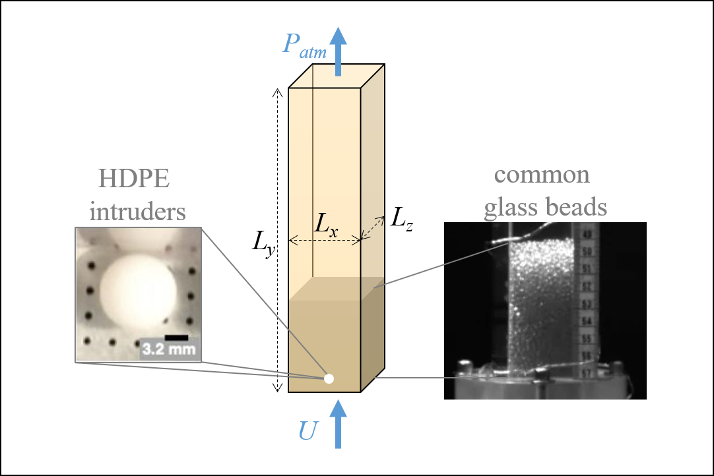

.. _sec:probdescription:

Problem Description
===================

*  Geometry

   *  :math:`L_x =  38.09 \pm 0.02` (mm)
   *  :math:`L_y = 228.6` (mm)
   *  :math:`L_z =  38.11 \pm 0.02` (mm)

*  Bed mass

   *  :math:`M = 177.46 \pm 0.01` (g)
   *  :math:`M = 227.47 \pm 0.01` (g)

*  Inflow superficial velocity

   *  :math:`U = 1.83` (m/s)
   *  :math:`U = 1.99` (m/s)
   *  :math:`U = 2.14` (m/s)

*  Outflow conditions

   *  :math:`P_{atm} = 83.77` (kPa)
   *  :math:`T_{atm} = 293.15` (K)

*  Notes

   *  TODO uncertainty on U 
   *  The distributor is a one-eighth inch thick disk, perforated 0.9 mm holes
      in a square grid with an edge size of 3.2 mm.
